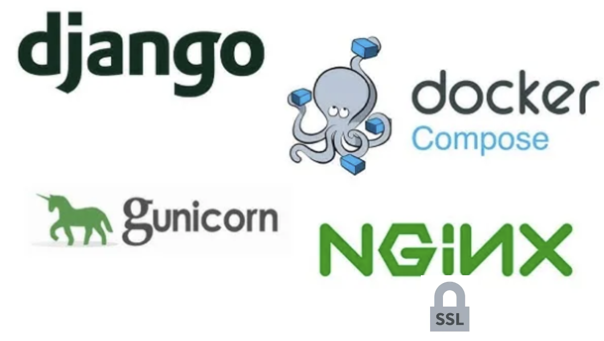

<h1>Dockerizing Django Application with Gunicorn - Nginx - PostgreSQL</h1>

<h2>A free container platform including open-source Blog CMS based on the Django with Gunicorn, Nginx and PostgreSQL</h2>

<h3>Django with Gunicorn</h3>

<h4>PyEditorial (Django Application) </h4>

It is a CMS application to be used as a container. For detailed information, visit https://github.com/mavenium/PyEditorial

<h3>Nginx</h3>

Nginx was used in the mix to act as a reverse proxy for Gunicorn to handle client requests and serve static files.

<h3>PostgreSQL</h3>

PostgreSQL was used as the database. PostgreSQL information has been entered in the application's "settings.py" file.

 

### Run with Docker

1. Install Docker on your operating system.
2. Install docker-compose on your operating system.
3. Run the following command to create and run the project.
4. If you want to access the application via HTTPS (with SSL), please add `127.0.0.1    testcaseproject.com` to your host file.
5. After adding testcase.com to the host file, please add `nginx-selfsigned.crt` certificate file in `nginx` folder to your trusted certificates.
6. cd dockerizing-django-gunicorn-nginx-postgresql-main             # change directory to run the bash script.
7. ./start.sh                                                       # run docker-compose file via start.sh
8. Go to `https://testcaseproject.com` or just type `testcaseproject.com` in your browser to use project for Nginx side, `localhost:8000` for application side (Gunicorn)

